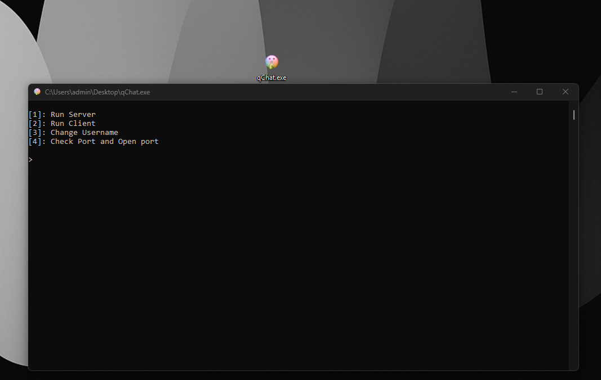

<p align="center">
  
</p>

<h1 align="center">
  <samp>qChat</samp>
</h1>

<p align="center">
  <b>A modular, console-based TCP messenger built entirely in Python using standard sockets.</b><br>
  <i>Allows real-time messaging and seamless file transfers between a server and multiple clients.</i>
</p>

<p align="center">
  <a href="https://python.org" target="_blank">
    
  </a>
  <a href="https://radmin-vpn.com" target="_blank">
    
  </a>
</p>

---

## 📸 Preview
<p align="center">
  
</p>

---

## ✨ Features

* **Multi-Client Architecture** — Server supports multiple simultaneous client connections.
* **Global Chat Room** — Messages are instantly broadcasted to all connected users.
* **File Transfer Protocol** — Send files bi-directionally (Client to Server / Server to Client).
* **Command-Driven Control** — System commands parsed via the `$` prefix.
* **Dynamic Identity** — Change your nickname on the fly during the session.
* **Modular Codebase** — Clean, decoupled architecture with 10+ specific modules.

---

## 🛠️ Command System

Messages starting with `$` are reserved for system operations and are not broadcast to the chat.

* `$sendfile` — Initiates a file transfer request.
* *(More commands can be implemented inside the modular handler).*

---

## 📁 Repository Structure

```bash
.
├── main.py                      # Application entry point (launches the main menu)
├── requirements.txt             # Project dependencies
├── icon.png                     # Application logo
├── screen.png                   # Interface screenshot
└── src/
    ├── console.py               # Console utility wrappers (e.g., screen clearing)
    ├── header.py                # Global imports aggregator
    ├── menu.py                  # Main menu interface and navigation
    ├── packet.py                # Packet size configurations and headers
    ├── port.py                  # Port scanner and manager (defaults to 5005)
    ├── user.py                  # Nickname manager and connection state definitions
    ├── crypto/
    │   ├── crypto_main.py       # Core cryptographic functions
    │   └── key_generation.py    # Key generation and management data
    ├── file/
    │   └── sendFile.py          # Binary file encoding and transmission logic
    ├── host/
    │   ├── client.py            # Core client engine (manages current session)
    │   ├── message.py           # Message processing and broadcasting handler
    │   ├── server.py            # Core server engine (tracks clients, IPs, and names)
    │   └── var.py               # System flags and request markers (e.g., \$filerequest)
    └── ui/
        └── interface.py         # UI core engine
```

---

## 🚀 Getting Started

### Prerequisites
* Python 3.14+ installed

### Installation

1. **Clone the repository:**
   ```bash
   git clone https://github.com
   cd qChat
   ```

2. **Run the application:**
   ```bash
   python main.py
   ```
